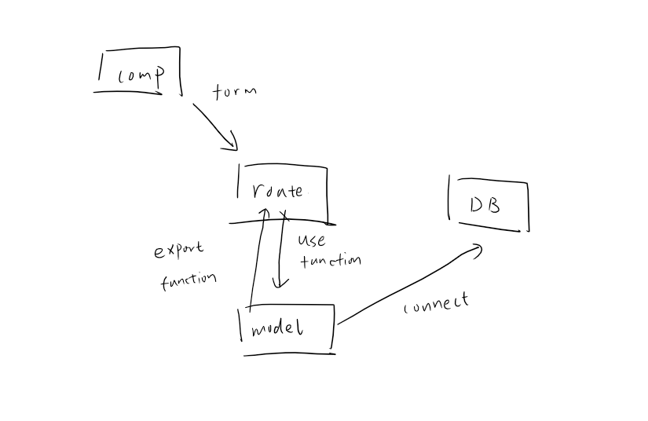

2024/1/15

## learn how to use mongoose connect to mongoDB.

### 1. we need component like form (we need to use CSR rn, because the interaction happened with user), the key point is how to handle submit by asyn, and fetch api with its config.

### 2. install mongoose and make a model(shcema and create correspond collection), the mongooose is the brige to connect route to the database

### 3. use route.js to accept the form from the front-end, and use export fuction by mongoose' model to send the data to database.
